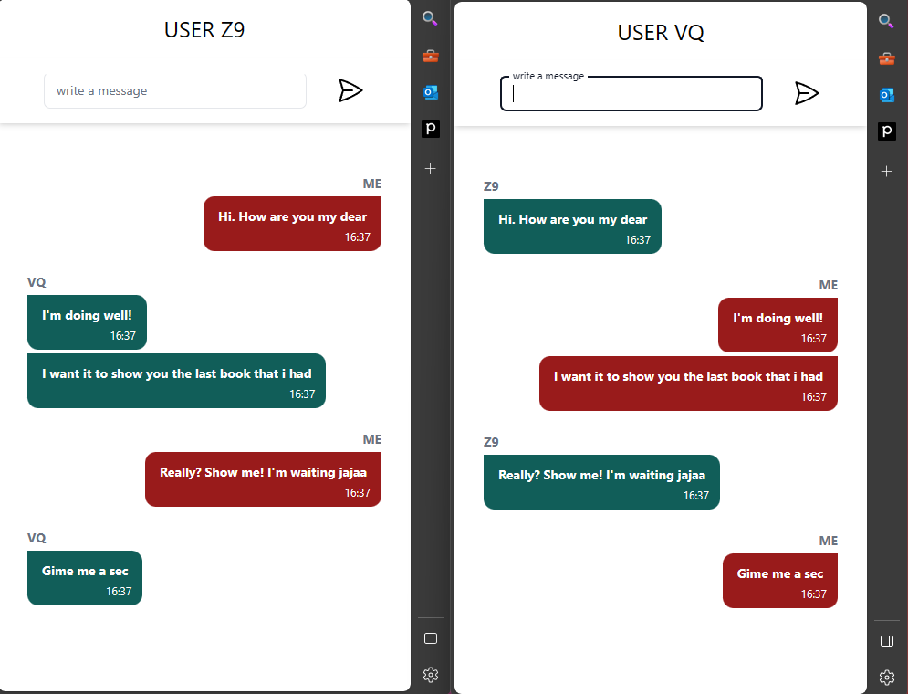

# Chat App

## Demo

## Descripción

Este proyecto consiste en una aplicación de chat en tiempo real desarrollada con tecnologías como React, Node.js y Socket.IO.

Permite a multiples usuarios conectarse a un canal de chat común y enviar mensajes públicos en tiempo real. Compatible con múltiples dispositivos.

Cuenta con funcionalidades como:

- Envío de mensajes en tiempo real sin refrescar
- Interfaz responsiva
- Hora de mensaje
- Inicio de seion.
- Crear cuenta de ususario.

## Instalación

1. Clona este repositorio
2. Ejecuta `npm install` tanto en la carpeta del front como en el back para instalar dependencias.
3. Configura la ruta de tu base de datos mongo en un archivo .env. El nombre de la variables estan en archivo config.js
4. Ejecuta `npm run dev` tanto en el back como en el front para inicializarlo en entorno de desarrollo.

## Tecnologías

- [React](https://reactjs.org/)
- [Vite](https://vitejs.dev/)
- [Node.js](https://nodejs.org/es/)
- [Socket.IO](https://socket.io/)
- [TailwindCSS](https://tailwindcss.com/)
